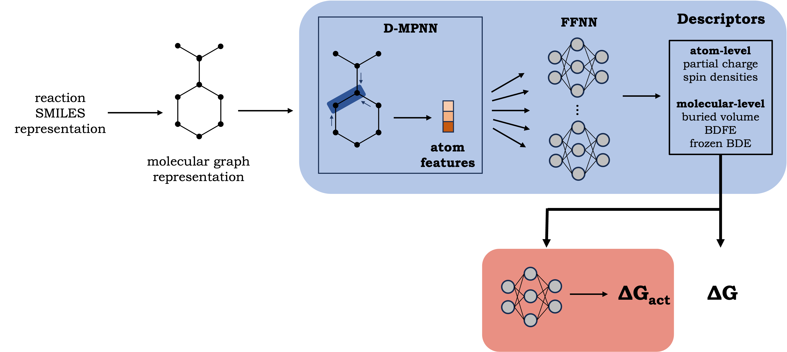

# Activation energy with tunneling correction prediction with a learned VB-representation and on-the-fly quantum mechanical descriptors

This repository contains the code for a fast prediction of activation energies. Code is provided "as-is". Minor edits may be required to tailor the scripts for different computational systems. 
The image below shows an schematic representation of the pipeline. 

### Conda environment

To set up a conda environment:

```
conda env create -f environment.yml
```

## Making predictions
As simple as:

```
python run.py --rxn_smiles 'CCO.C[CH2]>>CC[O].CC'
```

or

```
python run.py --csv_file tmp/examples.csv
```

The reaction smiles should be in the form of:

```
mol_1 + rad_2 >> rad_1 + mol_1
```

The first step is the prediction of relevant chemical information of reactants and products with the surrogate model, and a
learned VB-representation of the reaction smiles is generated. With this, the (tunneling corrected) activation energy is predicted. With the 
combination of both models, a full reaction profile can be generated in a fast and accurate way.

## Individual models
In the `reactivity_model` and `surrogate_model` directories you can find each individual model. In both folder there is also a README in case you want 
to use just one part of the pipeline.

## Citation
If you use this code, please cite:

```
@article{hat_predictor,
         title={Repurposing QM Descriptor Datasets for on the Fly Generation of Informative Reaction Representations: 
         Application to Hydrogen Atom Transfer Reactions}, 
         author={Javier E. Alfonso-Ramos, Rebecca M. Neeser and Thijs Stuyver},
         journal="{ChemRxiv}",
         year="{2023}",
         doi="10.26434/chemrxiv-2023-2n281",
         url="https://doi.org/10.26434/chemrxiv-2023-2n281"
}
```
